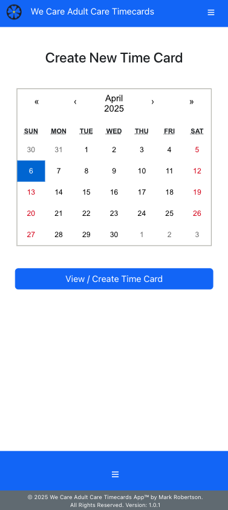
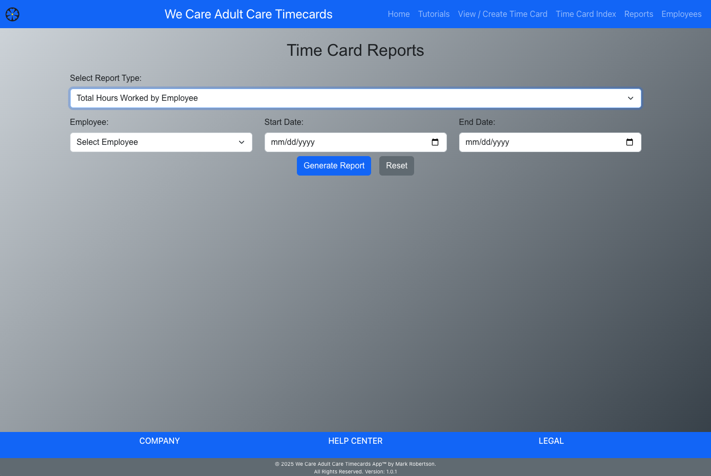
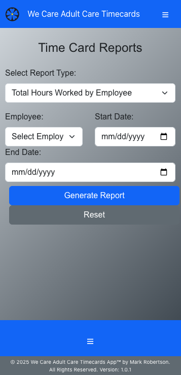
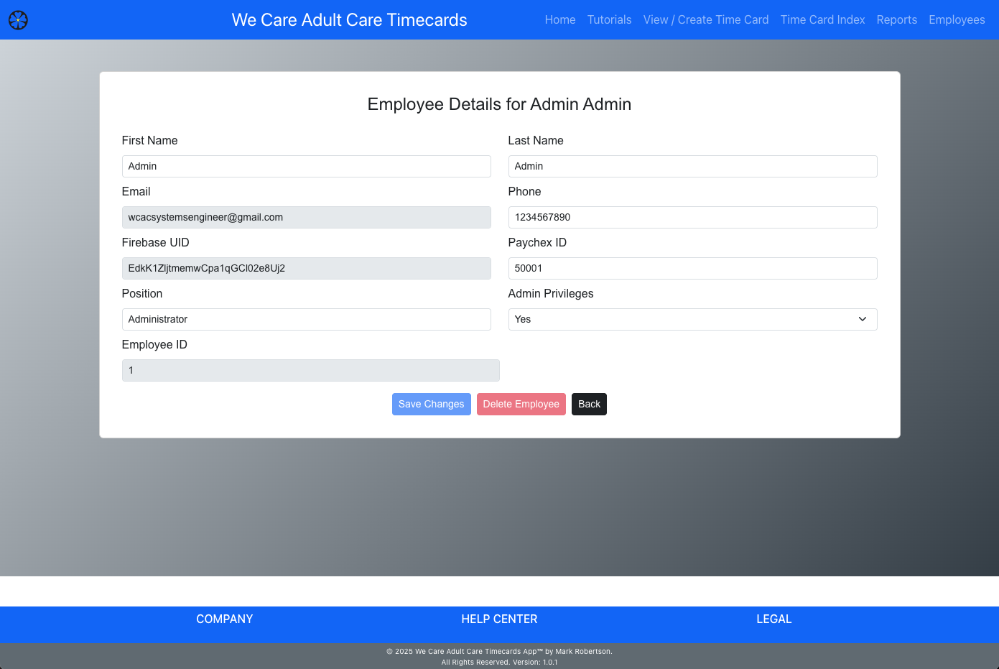
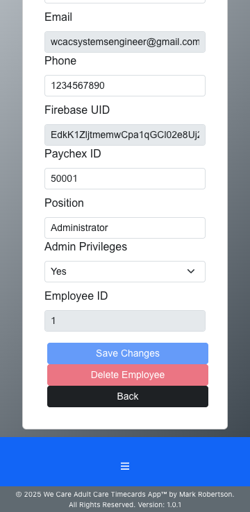

# WCAC Timecards App

## *Empowering Accurate, Efficient Employee Time Tracking*
> **Simplify Your Workflow with Precision and Speed**

For licensing inquiries, please contact Mark Robertson at [markrobertson67@gmail.com](mailto:markrobertson67@gmail.com).

## Table of Contents

- [Introduction](#introduction)
- [Features](#features)
- [Installation](#installation)
- [Usage](#usage)
  - [For Employees](#for-employees)
  - [For Administrators](#for-administrators)
- [Configuration](#configuration)
- [Backend Repository](#backend-repository)
- [License](#license)
- [Contact](#contact)

## Introduction

The WCAC Timecards App is a web-based solution designed to streamline timecard management and tracking for employees at We Care Adult Care, Inc. Employees can register and authenticate using Firebase, enabling them to create, view, and generate reports for their own timecards over any chosen time period. Meanwhile, administrators have the ability to access detailed reports for individual employees or the entire workforce, review aggregate data, and manage employee profiles. This application significantly reduces the time needed to verify employee hours. At the end of the designated two-week cycle, employees submit their timecards, which locks the data and prompts the start of a new cycle. 

## Features

- **User Authentication:** Secure login, signup, and password reset functionality using Firebase Authentication.
- ** Protected routes can only be accessed once logged in.
- **Timecard Management:** Create, view, and manage daily timecards.
- **Detailed Reports:** Generate detailed and aggregated reports (by week, month, and year) for timecard entries.
- **Responsive Design:** Optimized for both desktop and mobile viewing.
- **CSV Export:** Save report data as CSV for further analysis.
- **Dynamic Footer & Navbar:** Consistent UI components that adjust responsively.
- **Real-Time Updates:** Automatic email verification handling and profile completion prompts.

| Feature                         | Employee | Administrator |
| ------------------------------- | -------- | ------------- |
| Dashboard Access                | ✔️       | ✔️            |
| Timecard Management             | ✔️       | ✔️            |
| Profile Editing                 | ✔️       | ✔️            |
| Approve Timecards               | ❌       | ✔️            |
| Manage Users                    | ❌       | ✔️            |
| System Configuration            | ❌       | ✔️            |
| Generate Reports                | ✔️       | ✔️  Enhanced  |
| Integration with Third-Party Apps | ❌     | ✔️            |
| Mobile Access                   | ✔️       | ✔️            |

## Installation

1. **Clone the repository:**

   git clone https://github.com/markrobertson67/wcac-timecards.git
   cd wcac-timecards

2. **Install dependencies:**

npm install

3. **Set up environment variables:**

Create a .env file in the root directory and add your environment-specific variables (e.g., API keys, Firebase config).

4. **Run the application locally:**

npm start

5.  **Build for production:**

npm run build

## Usage

**For Employees:**

- **Login / Signup:**  
  Users can sign up or log in using their email and password.

  ## Screenshots

  ### Home Page
  <table>
  <tr>
    <td align="center">
      
       <strong>Desktop View</strong>
    </td>
    <td align="center">
      
       <strong>Mobile View</strong>
    </td>
  </tr>
</table>

- **Create and Update Timecards:**  
  Once logged in, employees can create a new timecard, fill in their work schedule, and submit their timecard.

  <table>
  <tr>
    <td align="center">
      
       <strong>Desktop View</strong>
    </td>
    <td align="center">
      
       <strong>Mobile View</strong>
    </td>
  </tr>
</table>

- **View Detailed Reports:**  
  Employees can view their submitted timecards and detailed reports on the status of their entries.

  <table>
  <tr>
    <td align="center">
      
       <strong>Desktop View</strong>
    </td>
    <td align="center">
      
       <strong>Mobile View</strong>
    </td>
  </tr>
</table>

- **Employees:**
  Employees can view their details and update seclect fields, while administyrators have acess to update most fields.

  <table>
  <tr>
    <td align="center">
      
       <strong>Desktop View</strong>
    </td>
    <td align="center">
      
       <strong>Mobile View</strong>
    </td>
  </tr>
</table>

## For Administrators

- **Access Reports:**  
  Admins have the ability to view aggregated reports (weekly, monthly, and yearly) for all employees.

- **Manage Profiles:**  
  Administrators can access and manage employee profiles, ensuring that all data is up-to-date.

  **Export Data:**  
  Reports can be exported as CSV files for offline analysis and record keeping.

## Configuration

- **Firebase:**  
  The app uses Firebase for authentication. Update your Firebase configuration in the `firebaseConfig.js` file.

- **Backend API:**  
  Configure the API URL in the environment variable `REACT_APP_API_URL` in your `.env` file.

- **Styling:**  
  Custom styles are defined in the `ReportPage.module.css` and `NavBar.css` files. Modify these files to adjust the look and feel.

## Backend Repository

The backend for the WCAC Timecards App is available at [WCAC Timecards Backend](https://github.com/MarkRobertson67/wcac_timecards_backend).

## License

This project is licensed under the [Proprietary Software License](./LICENSE.txt).  
For licensing inquiries, please contact [Mark Robertson](mailto:markrobertson67@gmail.com).

## Contact

For any questions, support, or feedback, please contact Mark Robertson at [Mark Robertson](mailto:markrobertson67@gmail.com).

