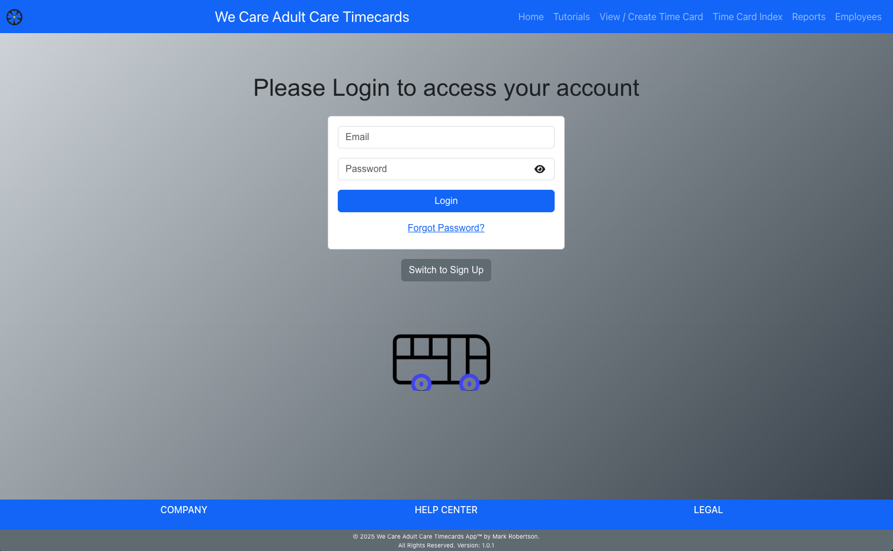
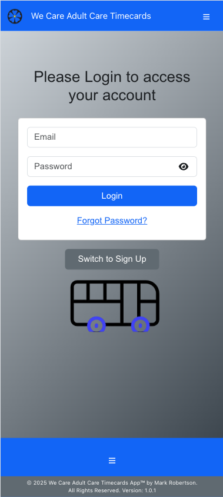
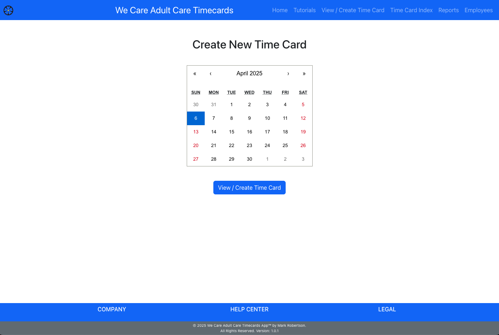

# WCAC Timecards App

## License

This project is licensed under the Proprietary Software License. See the [LICENSE.txt](./LICENSE.txt) file for details.

For licensing inquiries, please contact Mark Robertson at [markrobertson67@gmail.com](mailto:markrobertson67@gmail.com).

- **Screenshots Section:**

## Screenshots

## Table of Contents

- [Introduction](#introduction)
- [Features](#features)
- [Installation](#installation)
- [Usage](#usage)
  - [For Employees](#for-employees)
  - [For Administrators](#for-administrators)
- [Configuration](#configuration)
- [Backend Repository](#backend-repository)
- [License](#license)
- [Contact](#contact)

## Introduction

The WCAC Timecards App is a web-based application designed to manage and track timecards for employees at We Care Adult Care. The app allows employees to create and view their timecards, while administrators can access detailed reports, aggregate data, and manage employee profiles.

## Features

- **User Authentication:** Secure login, signup, and password reset functionality using Firebase Authentication.
- **Timecard Management:** Create, view, and manage daily timecards.
- **Detailed Reports:** Generate detailed and aggregated reports (by week, month, and year) for timecard entries.
- **Responsive Design:** Optimized for both desktop and mobile viewing.
- **CSV Export:** Save report data as CSV for further analysis.
- **Dynamic Footer & Navbar:** Consistent UI components that adjust responsively.
- **Real-Time Updates:** Automatic email verification handling and profile completion prompts.

## Installation

1. **Clone the repository:**

   git clone https://github.com/markrobertson67/wcac-timecards.git
   cd wcac-timecards

2. **Install dependencies:**

npm install

3. **Set up environment variables:**

Create a .env file in the root directory and add your environment-specific variables (e.g., API keys, Firebase config).

4. **Run the application locally:**

npm start

5.  **Build for production:**

npm run build

## Usage

**For Employees:**

- **Login / Signup:**  
  Users can sign up or log in using their email and password.

- **Create and Update Timecards:**  
  Once logged in, employees can create a new timecard, fill in their work schedule, and submit their timecard.

### Home Page
  

  <!-- Desktop View -->
  

    
    
Desktop View

  

  <!-- Mobile View -->
  

    
    
Mobile View

  

- **View Detailed Reports:**  
  Employees can view their submitted timecards and detailed reports on the status of their entries.

## For Administrators

- **Access Reports:**  
  Admins have the ability to view aggregated reports (weekly, monthly, and yearly) for all employees.

- **Manage Profiles:**  
  Administrators can access and manage employee profiles, ensuring that all data is up-to-date.

  **Export Data:**  
  Reports can be exported as CSV files for offline analysis and record keeping.

## Configuration

- **Firebase:**  
  The app uses Firebase for authentication. Update your Firebase configuration in the `firebaseConfig.js` file.

- **Backend API:**  
  Configure the API URL in the environment variable `REACT_APP_API_URL` in your `.env` file.

- **Styling:**  
  Custom styles are defined in the `ReportPage.module.css` and `NavBar.css` files. Modify these files to adjust the look and feel.

## Backend Repository

The backend for the WCAC Timecards App is available at [WCAC Timecards Backend](https://github.com/MarkRobertson67/wcac_timecards_backend).

## License

This project is licensed under the [Proprietary Software License](./LICENSE.txt).  
For licensing inquiries, please contact [Mark Robertson](mailto:markrobertson67@gmail.com).

## Contact

For any questions, support, or feedback, please contact Mark Robertson at [Mark Robertson](mailto:markrobertson67@gmail.com).
